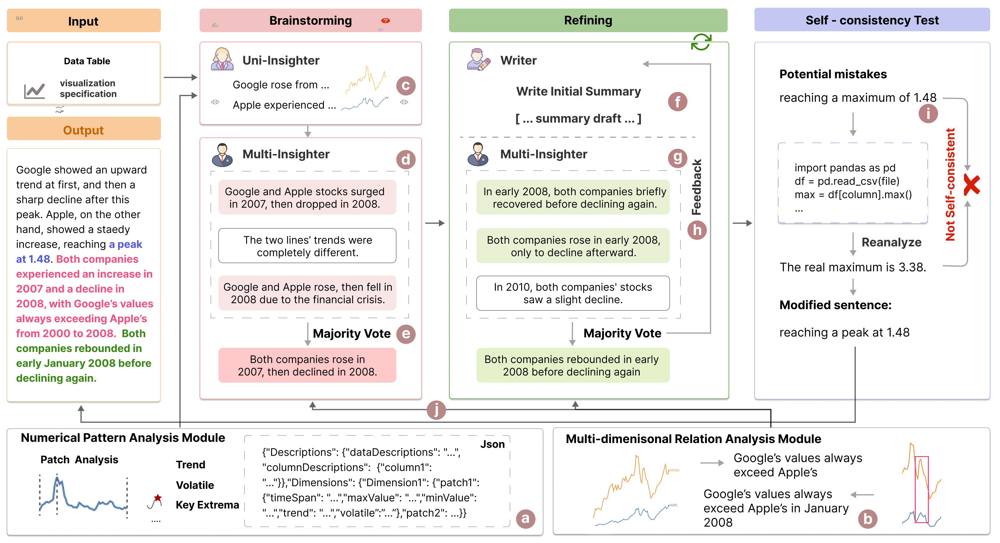
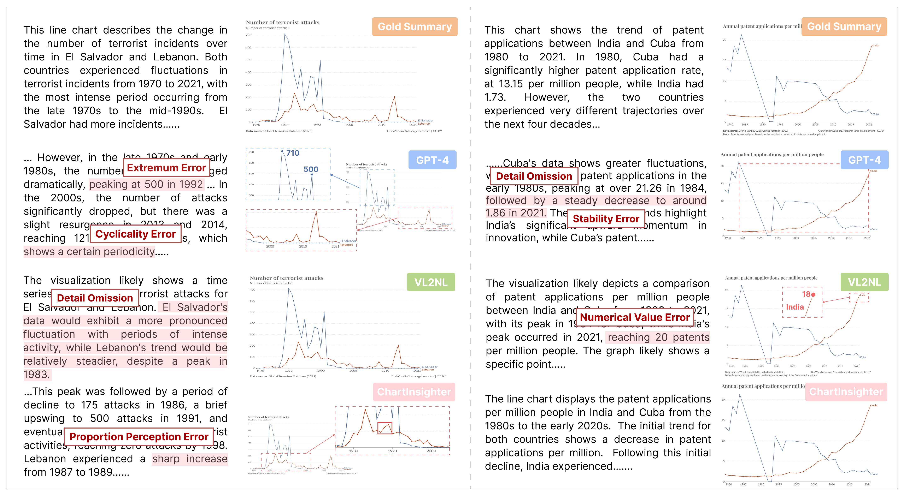

<div ><h1>ChartInsighter: An Approach for Mitigating Hallucination in Time-series Chart Summary Generation with A Benchmark Dataset</h1></div>
<p align="center"><i>Fen Wang, Bomiao Wang, Xueli Shu, Zhen Liu, Zekai Shao, Chao Liu, Siming Chen, ChartInsighter: An Approach for Mitigating Hallucination in Time-series Chart Summary Generation with A Benchmark Dataset, IEEE Transactions on Visualization and Computer Graphics (IEEE PacificVis 2025), Accepted, 2025</i></p>

Effective chart summary can significantly reduce the time and effort decision makers spend interpreting charts, enabling precise and efficient communication of data insights. Previous studies have faced challenges in generating accurate and semantically rich summaries of time-series data charts. In this paper, we identify summary elements and common hallucination types in the generation of time-series chart summaries, which serve as our guidelines for automatic generation. We introduce ChartInsighter, which automatically generates chart summaries of time-series data, effectively reducing hallucinations in chart summary generation. Specifically, we assign multiple agents to generate the initial chart summary and collaborate iteratively, during which they invoke external data analysis modules to extract insights and compile them into a coherent summary. Additionally, we implement a self-consistency test method to validate and correct our summary. We create a high-quality benchmark of charts and summaries, with hallucination types annotated on a sentence-by-sentence basis, facilitating the evaluation of the effectiveness of reducing hallucinations. Our evaluations using our benchmark show that our method surpasses state-of-the-art models, and that our summary hallucination rate is the lowest, which effectively reduces various hallucinations and improves summary quality.



## Benchmark

We collected **75** pairs of time-series line charts and corresponding summaries, totaling **2,693** sentences, across three complexity levels: simple, moderate, and complex. Each chart data within this dataset includes four modalities: image, CSV, Vega-Lite specification, gold summary created manually, summary generated by ChartInsighter, [VL2NL](https://github.com/hyungkwonko/chart-llm), and GPT-4, with hallucination types annotated at sentence level for all summaries, aiming to evaluate the effectiveness of reducing hallucinations.



## Hallucination Type

We have systematically summarized a set of hallucination types and their definitions that occur when LLMs generate summaries for time-series data. We have identified a total of 10 types of hallucination.

<details><summary> Hallucination Type:</summary>

**Extremum Error.** This error occurs when LLMs incorrectly describe a local extremum as the absolute maximum or minimum, when in fact it is just a regular peak or trough value, or mistakenly identify an ordinary value as an extremum. 

**Numerical Value Error.** This error occurs when there is a discrepancy in describing or calculating quantitative data. The rarity of this error stems not from the fact that the LLM has strong numerical computation capabilities, but from the fact that it rarely includes insights that require numerical calculations in its summaries, thus not exposing this issue much.

**Trend Direction Error.** This error arises when LLMs incorrectly identify the direction of a trend, such as misinterpreting an upward trend as a downward one, or vice versa.

**Multidimensional Trend Error.** LLMs either mistake the same trends/relations as contrast, or conversely, mistake contrast trends/relations as the same. When describing multidimensional trends, they mix data insights from different dimensions together, leading to a very confusing and disorganized presentation. For example, LLMs combine two dimensions into one, like “Google’s stock price rose before 2010 and peaked in 2012”. However, “peaked in 2012” is the attribute of another dimension, not Google.

**Range Error.** When analyzing time-series data, the start and end times of trends are incorrectly identified. When a sudden trend reversal occurs, LLMs fail to promptly recognize and adjust to changes in the data, leading to an incorrect description of the trend.

**Cyclicality Error.** This error occurs when non-cyclical trends are incorrectly interpreted as cyclical.

**Stability Error.** This error occurs when a fluctuating trend is incorrectly described as stable, or when stable data is misrepresented as fluctuating, leading to a skewed perception of the actual trend.

**Detail Omission.** This error refers to when LLMs tend to generalize data within a specific range, focusing on overall trends while overlooking key fluctuations and turning points in time-series data. This oversight results in the masking of crucial underlying information, leading to an incomplete understanding of the data and potentially affecting the final reasoning and decision-making. Additionally, when describing multidimensional time-series line charts, LLMs tend to focus on data from a single dimension, overlooking the others in summary.

**Junk Description.** This drawback can take the form of broad generalizations that fail to specify key details, such as saying “some countries grow faster and others slower” without naming the countries, or frequent mention of various numerical values that represent meaningless points. It can confuse the reader and reduce the effectiveness of the description.

**Proportion Perception Error.** When describing fluctuations, terms like “significant” are often inaccurately used, even if the magnitude of these fluctuations is quite minor compared to other parts of the same line or to fluctuations in other lines. This error highlights a common issue where LLMs fail to appropriately scale its descriptions relative to the overall data variability

</details>

In our benchmark, we manually annotated each summary sentence, marking the presence of any hallucination types and categorizing them accordingly.

## **What Can Benchmark Evaluate**

1. The Hallucination Rate of the generated summary.

2. The Semantic Richness of the generated summary.

## Citation

If you find that ChartInsighter helps your research, please consider citing it:  

```bibtex
@article{wang2025chartinsighter,
  title={ChartInsighter: An Approach for Mitigating Hallucination in Time-series Chart Summary Generation with A Benchmark Dataset},
  author={Wang, Fen and Wang, Bomiao and Shu, Xueli and Liu, Zhen and Shao, Zekai and Liu, Chao and Chen, Siming},
  journal={arXiv preprint arXiv:2501.09349},
  year={2025}
}
```
